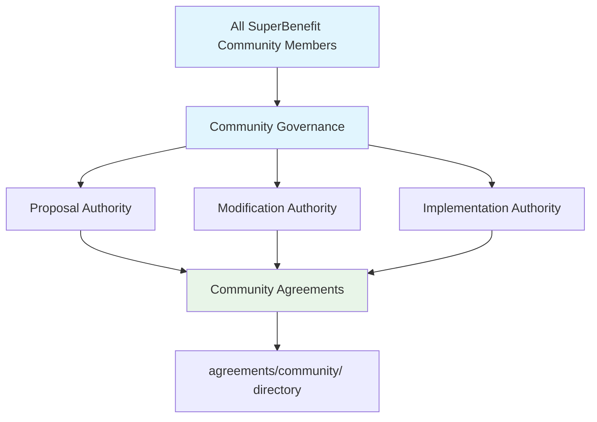
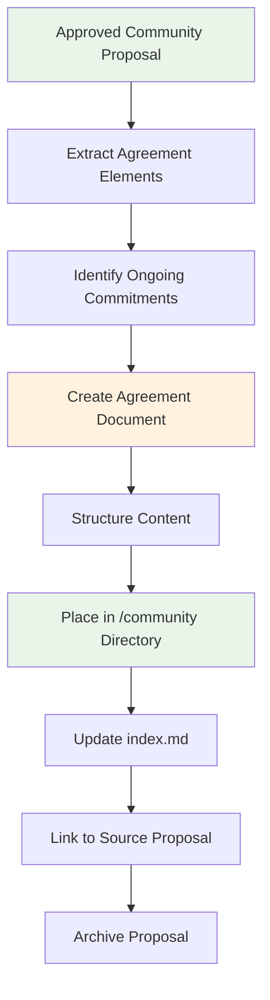
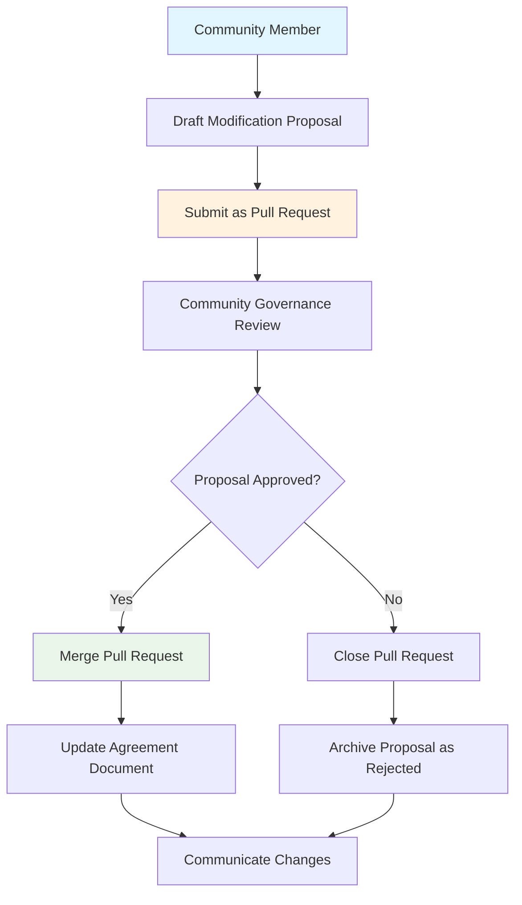

# Community Agreements Directory

This directory contains agreements that establish cultural foundations and behavioral expectations for all SuperBenefit participants. For conceptual understanding of community agreements, see [index.md](index.md). This readme provides technical workflows for creating and modifying community agreements within SuperBenefit's governance framework.

## Understanding Community Agreements

SuperBenefit's community culture reflects our understanding that sustainable transformation requires more than technical innovation or policy change – it demands new patterns of relationship that embody the principles we seek to advance. Our community agreements make explicit the values and behaviors that create conditions for this cultural transformation.

These agreements acknowledge that many of us come from contexts that have normalized scarcity mindsets, extractive relationships, and competitive dynamics. Creating alternatives requires intentional practice in developing abundance consciousness, mutualistic coordination, and collaborative problem-solving – skills that many of us are learning together as part of SuperBenefit's community development.

## Community Agreement Authority

Community agreements are governed exclusively through community governance processes, which include all SuperBenefit community members. This authority boundary ensures that cultural standards and behavioral expectations reflect input from the entire community rather than being determined by a subset of participants.



Community members have standing to propose new community agreements or modifications to existing ones through established proposal mechanisms. SuperBenefit DAO contributors participate in community governance as community members, but their operational roles do not grant additional authority over community agreements.

## Creating Community Agreements

Community agreements are derived from approved community governance proposals. This ensures all agreements trace to legitimate collective decisions that included appropriate community participation.

### Derivation Workflow

When a community governance proposal establishing a new agreement is approved:



**Extract Agreement Elements**: Look for sections in the proposal that establish ongoing behavioral expectations, cultural standards, or participation frameworks rather than one-time decisions or administrative actions.

**Structure Content**: Follow the standard agreement format established in [../readme.md](../readme.md), ensuring the agreement clearly identifies its applicability, core provisions, and relationship to other community standards.

**Integration**: Update the directory index file to reference the new agreement and ensure proper cross-referencing with related governance documents.

### Community Agreement Characteristics

Community agreements typically address:
- Behavioral expectations that apply to all participants
- Cultural standards that define SuperBenefit's collaborative environment  
- Participation frameworks that welcome diverse forms of contribution
- Conflict resolution approaches that emphasize learning and restoration
- Community boundaries that protect collective wellbeing

These agreements should use language accessible to all community members regardless of their technical background or familiarity with governance terminology.

## Modifying Community Agreements

Changes to community agreements require formal proposals submitted through community governance processes. The modification authority remains exclusively with community governance to preserve democratic control over cultural standards.

### Modification Process



**Proposal Requirements**: Modification proposals must clearly identify what sections are being changed, provide rationale for the changes, and demonstrate how modifications support SuperBenefit's mission and community wellbeing.

**Pull Request Integration**: Following the framework established in [GOVERNANCE.md](../../GOVERNANCE.md), proposals requiring agreement changes are submitted as pull requests containing both the proposal document and the specific changes to agreement text.

**Community Review**: The proposal undergoes community governance deliberation, allowing all community members to provide input on changes to foundational cultural agreements.

## Integration with Operational Domain

Community agreements create the cultural foundation upon which SuperBenefit DAO's operational agreements build. This integration ensures organizational effectiveness serves community values rather than existing separately from them.

### Relationship Patterns

**Cultural Foundation**: Community agreements establish behavioral norms and collaborative principles that operational contributors carry into their formal roles within SuperBenefit DAO. This creates continuity across different levels of engagement.

**Shared Standards**: SuperBenefit DAO contributors remain bound by community agreements in all their interactions, with operational agreements adding role-specific commitments rather than replacing community standards.

**Alignment Mechanisms**: When potential conflicts arise between community cultural standards and operational efficiency, resolution processes prioritize maintaining alignment with community agreements while finding workable operational approaches.

### Cross-Reference Management

When creating or modifying community agreements, consider their relationship to operational agreements in [../dao/](../dao/). Ensure that community standards support rather than conflict with the coordination mechanisms that enable effective organizational function.

Community agreements may establish frameworks that operational agreements later reference or build upon. In such cases, create clear connections between the foundational community standards and their operational implementations.

## Directory Structure and Organization

Community agreements are organized to support easy navigation by community members seeking to understand participation expectations:

```
community/
├── index.md              # User-facing overview
├── readme.md            # This technical guide
├── behavioral_guidelines.md  # Example community agreement
├── participation_framework.md  # Example community agreement
└── conflict_resolution.md     # Example community agreement
```

As the directory grows, consider topical organization that reflects different aspects of community life while maintaining clear connections between related agreements.

## Quality Considerations for Community Agreements

Community agreements require particular attention to accessibility and inclusivity since they apply to all SuperBenefit participants:

**Language Accessibility**: Use clear, jargon-free language that welcomes participants regardless of their technical background or familiarity with governance terminology.

**Cultural Sensitivity**: Ensure agreements acknowledge diverse communication styles, conflict comfort levels, and forms of contribution without imposing single approaches as universal standards.

**Practical Applicability**: Include concrete examples that help community members understand how abstract principles translate into everyday interactions and collaborative practices.

**Evolution Pathways**: Build in mechanisms for community input on agreement effectiveness, recognizing that cultural understanding develops through collective experience and learning.

Community agreements succeed when they create conditions for authentic participation rather than imposing barriers to engagement. Regular assessment of how well agreements serve diverse community members helps identify opportunities for refinement that better support SuperBenefit's mission of inclusive transformation.