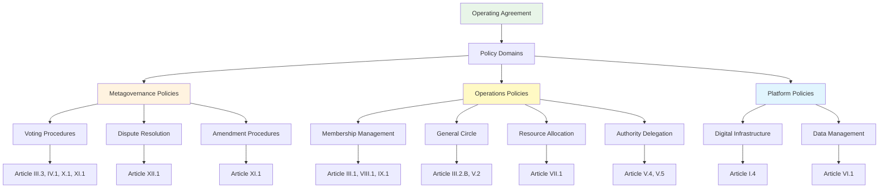
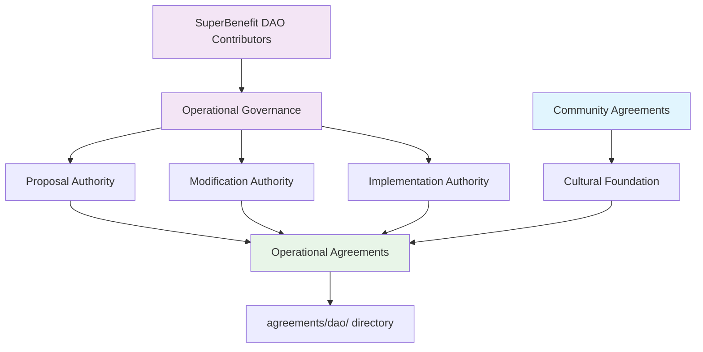
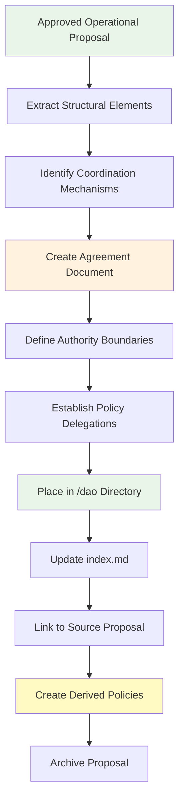
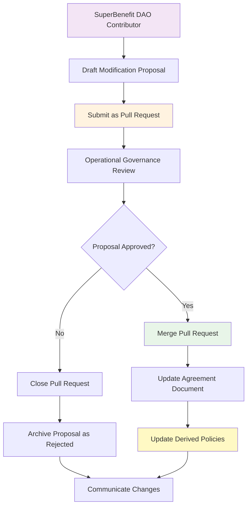

# Operational Agreements Directory

This directory contains agreements that define structures and processes for SuperBenefit DAO contributors who take on formal organizational roles. For conceptual understanding of operational governance, see [index.md](index.md). This readme provides technical workflows for creating and modifying operational agreements within SuperBenefit's governance framework.

## Understanding Operational (DAO) Agreements
SuperBenefit's operational governance reflects our commitment to demonstrating that organizational coordination can embody transformative principles rather than reproducing extractive patterns common in traditional structures. Our operational agreements create frameworks that distribute authority appropriately, support contributor autonomy, and maintain accountability to our collective mission.

The operational framework embodies our principle of minimum viable coordination, establishing just enough structure to enable productive collaboration without creating unnecessary bureaucracy. These agreements focus on clarifying interfaces between different working domains while preserving autonomy for contributors to develop approaches that serve their specific contexts and capabilities.

## Operating Agreement Integration Map

The Operating Agreement establishes the legal framework for SuperBenefit DAO while delegating detailed governance to policies maintained in the DAO State. This integration map shows how Operating Agreement sections connect to corresponding policy documents and authority delegation paths.

### Operating Agreement to DAO State Reference Matrix

| Operating Agreement Section | Referenced DAO State Policy | Policy Domain | Authority Level |
|----------------------------|----------------------------|---------------|-----------------|
| **I.4** - Principal Office | Digital Infrastructure Policy | Platforms | General Circle |
| **III.1** - Member Eligibility | Membership Management Policy | Operations | Member Governance |
| **III.2.B** - General Circle Members | General Circle Policy | Operations | Member Governance |
| **III.3** - Voting Weight | Voting Procedures Policy | Metagovernance | Member Governance |
| **IV.1** - Management Rights | Voting Procedures Policy | Metagovernance | Member Governance |
| **V.2** - General Circle | General Circle Policy | Operations | Member Governance |
| **V.4** - Authority Delegation | Authority Delegation Policy | Operations | Member Governance |
| **V.5** - Authority to Bind Company | Authority Delegation Policy | Operations | Member Governance |
| **VI.1** - Required Records | Data Management Policy | Platforms | General Circle |
| **VII.1** - Initial Contributions | Resource Allocation Policy | Operations | Member Governance |
| **VIII.1** - Member Status Cessation | Membership Management Policy | Operations | Member Governance |
| **IX.1** - New Members | Membership Management Policy | Operations | Member Governance |
| **X.1** - Dissolution Events | Voting Procedures Policy | Metagovernance | Member Governance |
| **XI.1** - Amendment Procedures | Voting Procedures Policy | Metagovernance | Member Governance |
| **XII.1** - Dispute Resolution | Dispute Resolution Policy | Metagovernance | Member Governance |

### Policy Integration Flow



### Authority Delegation Hierarchy

The Operating Agreement establishes a clear delegation hierarchy that distributes decision-making authority while maintaining Member sovereignty:

**Member Governance Authority**
- Constitutional amendments (Article XI.1)
- Fundamental policy establishment and modification
- General Circle selection and oversight (Article V.2)
- Resource allocation frameworks (Article VII.1)
- Membership criteria and procedures (Articles III.1, VIII.1, IX.1)

**General Circle Delegated Authority**
- Platform policy implementation within established frameworks
- Operational coordination as defined in General Circle Policy
- Digital infrastructure management per Digital Infrastructure Policy
- Day-to-day administration within approved budgets and procedures

**Policy Domain Authority**
- Domain-specific policy modification within delegated boundaries
- Implementation procedures and operational details
- Technical specifications and standards
- Performance monitoring and improvement recommendations

### Cross-Reference Dependencies

Understanding policy interdependencies helps maintain governance coherence:

**Core Dependencies**
- Voting Procedures Policy → All Member decision-making processes
- Membership Management Policy → General Circle Policy (member eligibility for coordination roles)
- Authority Delegation Policy → All domain-specific policies (delegation boundaries)
- Digital Infrastructure Policy → Data Management Policy (platform integration)

**Circular References Requiring Coordination**
- Amendment Procedures ↔ Voting Procedures (constitutional changes affect voting)
- General Circle Policy ↔ Authority Delegation Policy (coordination authority boundaries)
- Membership Management ↔ Dispute Resolution (membership appeals processes)

### Implementation Validation Checklist

When implementing Operating Agreement changes or policy modifications, verify:

- [ ] Operating Agreement section correctly references corresponding DAO State policy
- [ ] Policy document exists and addresses all requirements from Operating Agreement
- [ ] Authority delegation matches between Operating Agreement and policy documents
- [ ] Cross-references updated in all affected policies
- [ ] No circular dependencies create logical contradictions
- [ ] Timeline compliance with Article XIII.5 (24-month implementation requirement)
- [ ] Legal requirements preserved from Marshall Islands DAO LLC statutes

This integration map ensures that the lightweight Operating Agreement maintains legal compliance while enabling detailed governance through the comprehensive DAO State policy framework.

## Operational Agreement Authority

Operational agreements are governed through operational governance processes, which include SuperBenefit DAO contributors who take on formal roles in organizational coordination. This authority structure ensures that coordination mechanisms reflect input from those actively engaged in organizational work while remaining accountable to broader community values.



SuperBenefit DAO contributors have standing to propose new operational agreements or modifications through established operational governance mechanisms. Community members participate in operational governance by becoming contributors, but community membership alone does not grant authority over operational agreements.

## Creating Operational Agreements

Operational agreements are derived from approved operational governance proposals, ensuring all coordination structures trace to collective decisions made by those responsible for implementation.

### Derivation Workflow

When an operational governance proposal establishing a new agreement is approved:



**Extract Structural Elements**: Identify sections in the proposal that establish ongoing organizational structures, decision-making frameworks, or resource allocation mechanisms rather than one-time actions or administrative decisions.

**Define Authority Boundaries**: Clearly specify what authority the agreement establishes, what decisions it enables, and how it relates to existing operational structures and community agreements.

**Establish Policy Delegations**: Many operational agreements delegate policy-making authority to specific roles or circles. Document these delegations clearly and create corresponding policy frameworks following procedures in [../../policies/readme.md](../../policies/readme.md).

### Operational Agreement Characteristics

Operational agreements typically address:
- Decision-making frameworks and authority distribution
- Resource allocation processes and stewardship responsibilities  
- Role definitions and coordination mechanisms
- Accountability structures and reporting relationships
- Integration mechanisms with community culture and external partnerships

These agreements should provide sufficient structure to enable effective coordination while preserving appropriate autonomy for contributors to adapt approaches to local contexts.

## Modifying Operational Agreements

Changes to operational agreements require formal proposals submitted through operational governance processes. This ensures modifications reflect collective wisdom of contributors responsible for implementing coordination mechanisms.

### Modification Process



**Proposal Requirements**: Modification proposals must identify specific coordination problems being addressed, demonstrate how changes improve organizational effectiveness while maintaining alignment with community values, and consider impacts on related policies and operational practices.

**Policy Impact Assessment**: Operational agreement changes often affect multiple policy domains. Identify all policies that implement or reference the agreement and update them accordingly, following domain-specific processes outlined in [../../policies/readme.md](../../policies/readme.md).

**Integration Verification**: Ensure changes maintain appropriate relationships with community agreements and don't create conflicts between cultural standards and operational requirements.

## Authority Delegation and Policy Creation

Operational agreements frequently delegate policy-making authority to specific roles, circles, or teams. This delegation enables responsive policy development within established boundaries while maintaining accountability to collective governance.

### Delegation Framework

```mermaid
graph TD
    A[Operational Agreement] --> B[Delegates Authority]
    B --> C[General Circle]
    B --> D[Working Groups]
    B --> E[Specialized Roles]
    
    C --> F[Platform Policies]
    D --> G[Operational Policies]
    E --> H[Domain-Specific Policies]
    
    F --> I[policies/platforms/]
    G --> J[policies/operations/]
    H --> K[policies/[domain]/]
    
    style A fill:#e8f5e8
    style C fill:#fff3e0
    style D fill:#fff3e0
    style E fill:#fff3e0
```

When operational agreements establish new delegations:

**Document Delegation Clearly**: Specify the scope of delegated authority, any constraints or reporting requirements, and the process for modifying or revoking the delegation.

**Create Policy Framework**: Establish initial policy documents in appropriate domains following the structure outlined in [../../policies/readme.md](../../policies/readme.md).

**Establish Accountability**: Link policy domains back to authorizing agreements and ensure mechanisms exist for reviewing effectiveness of delegated authority.

## Integration with Community Foundation

Operational agreements build upon the cultural foundation established by community agreements while creating structures that enable effective organizational coordination. This integration ensures organizational effectiveness serves community values.

### Foundation Relationship

**Cultural Continuity**: Operational agreements should explicitly reference community agreements as their cultural foundation, ensuring coordination mechanisms embody rather than contradict community values.

**Participation Pathways**: Create clear connections between community participation and operational contribution, enabling community members to understand how they can engage with organizational coordination if they choose.

**Value Alignment**: Regular assessment of how well operational structures serve community mission helps identify when agreements need modification to maintain authentic alignment.

### Cross-Reference Management

When creating or modifying operational agreements, verify alignment with community agreements in [../community/](../community/) and identify opportunities to strengthen rather than complicate the relationship between cultural and structural elements.

Operational agreements may reference community agreements as the basis for their authority or as constraints on their implementation. Maintain these references accurately to preserve the integrity of the overall governance framework.

## Directory Structure and Organization

Operational agreements are organized to support navigation by contributors seeking to understand organizational coordination mechanisms:

```
dao/
├── index.md                    # User-facing overview
├── readme.md                  # This technical guide
├── operating-agreement.md     # Primary legal agreement
├── general_circle_charter.md  # Example operational agreement
├── resource_stewardship.md    # Example operational agreement
├── contributor_framework.md   # Example operational agreement
└── coordination_mechanisms.md # Example operational agreement
```

As SuperBenefit DAO's organizational complexity evolves, consider organizing agreements by functional area while maintaining clear relationships between different coordination mechanisms.

## Quality Considerations for Operational Agreements

Operational agreements require attention to both effectiveness and accessibility since they define coordination mechanisms that must work in practice while remaining comprehensible to contributors:

**Practical Effectiveness**: Ensure agreements create coordination mechanisms that actually work given SuperBenefit DAO's resource constraints, contributor capacity, and operational context.

**Clear Authority**: Define decision-making authority precisely enough to prevent conflicts and gaps while preserving appropriate flexibility for contextual adaptation.

**Implementation Pathways**: Include sufficient detail about how coordination mechanisms will function in practice, including initial implementation steps and ongoing maintenance requirements.

**Evolution Mechanisms**: Build in processes for assessing operational effectiveness and adapting agreements based on practical experience with coordination challenges.

Operational agreements succeed when they enable effective coordination that serves SuperBenefit's mission while honoring the community culture that provides their foundation. Regular evaluation of how well agreements support both organizational effectiveness and community values helps identify opportunities for refinement that strengthen both domains.
