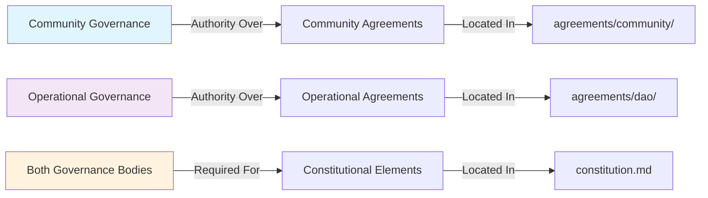
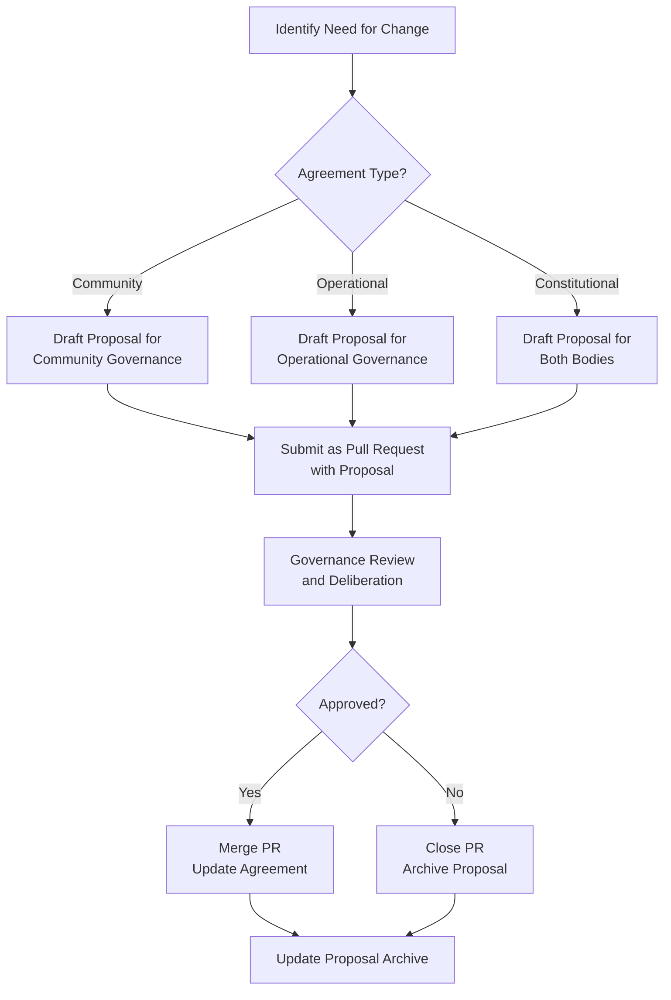

# Agreements Directory

This directory contains SuperBenefit's foundational agreements that establish relationships between participants. For conceptual understanding of our agreement philosophy, see the [index.md](index.md) file. This readme provides technical guidance for working with agreements in the governance repository.

## Authority Framework

SuperBenefit's agreements are governed through our dual membership structure, with clear authority boundaries that determine who can create or modify specific agreements. Understanding these boundaries is essential for proper repository maintenance.



**Community agreements** in the `/community` subdirectory can only be modified through community governance processes. All SuperBenefit community members have standing to propose changes through established proposal mechanisms. These agreements establish cultural foundations and behavioral expectations for all participants.

**Operational agreements** in the `/dao` subdirectory require proposals from SuperBenefit DAO contributors through operational governance processes. These define structures, roles, and coordination mechanisms for organizational function.

**Constitutional elements** that affect relationships between membership classes or fundamental organizational structure require approval from both governance bodies. These are documented in the root-level `constitution.md` rather than subdirectories.

## Creating New Agreements

New agreements are created by deriving them from approved governance proposals. This ensures all agreements trace to legitimate collective decisions rather than being created unilaterally.

### Workflow for Agreement Creation

When a proposal that establishes a new agreement is approved:

1. **Locate the approved proposal** in the governance system (snapshot, forum, or other platform)
2. **Extract agreement content** from the proposal, identifying sections that establish ongoing commitments
3. **Create the agreement document** following our documentation standards:
   - Use clear, descriptive filename: `membership_agreement.md` or `contributor_guidelines.md`
   - Include frontmatter with description
   - Structure content with logical sections
4. **Establish proper placement** based on agreement type:
   - Community agreements → `/agreements/community/`
   - Operational agreements → `/agreements/dao/`
   - Cross-cutting agreements → Consult governance facilitators
5. **Update index files** in the relevant directory to reference the new agreement
6. **Archive the proposal** following procedures in [proposals/readme.md](../proposals/readme.md)

### Agreement Document Structure

Each agreement should follow this general structure:

```markdown
---
description: Brief description of what this agreement governs
---

# Agreement Title

Opening paragraph explaining the agreement's purpose and scope within SuperBenefit's governance.

## Applicability

Clear statement of who this agreement applies to and in what contexts.

## Core Provisions

The main substance of the agreement, organized into logical sections that establish:
- Expectations and commitments
- Rights and responsibilities  
- Coordination mechanisms
- Accountability frameworks

## Relationship to Other Agreements

How this agreement relates to and builds upon other governance documents.

## Modification Process

Reference to the appropriate governance process for future changes.
```

## Modifying Existing Agreements

Agreement modifications follow formal governance processes to maintain legitimacy. The workflow depends on the agreement type and proposed changes.

### Modification Workflow



Key requirements for modification proposals:

- **Clear scope**: Identify specific sections being changed and why
- **Authority verification**: Ensure proposal goes through correct governance body
- **Integration check**: Verify changes don't conflict with other agreements
- **Implementation plan**: For complex changes, include transition approach

### Pull Request Integration

As outlined in [governance.md](../governance.md), agreement modifications are submitted as pull requests containing both the proposal and the specific changes. This creates clear connections between collective decisions and their implementation.

The pull request should:
- Link to the governance proposal
- Show exact changes to agreement text
- Update any affected cross-references
- Include updates to relevant index files

## Cross-References and Dependencies

Agreements often reference each other and establish frameworks that policies later implement. Maintaining these connections is crucial for repository coherence.

When creating or modifying agreements:
- Check for references to other agreements that might need updating
- Identify policies that implement the agreement's frameworks
- Update cross-references in both directions
- Consider creating a dependency map for complex relationships

## Integration with Policy Development

Agreements often establish high-level frameworks that require detailed policy implementation. When an agreement delegates authority or establishes new coordination requirements:

1. **Identify policy needs** created by the agreement
2. **Determine policy domain** based on delegated authority
3. **Create policy documents** following procedures in [policies/readme.md](../policies/readme.md)
4. **Link policies back** to authorizing agreements

This creates traceable connections from foundational agreements through to operational policies, supporting accountability and understanding.

## Quality Considerations

While the [state management policies](../policies/metagovernance/state/readme.md) govern overall repository quality, agreements require particular attention to:

- **Clarity**: Agreements establish relationships that may last years
- **Completeness**: Missing provisions can create governance gaps
- **Compatibility**: New agreements must align with existing ones
- **Accessibility**: Language should be understandable to affected participants

Regular review of agreements helps identify needs for clarification or evolution as SuperBenefit's understanding deepens through practice.

## Common Patterns

Through experience, certain agreement patterns have proven effective:

- **Graduated commitments**: Different levels of participation with different expectations
- **Escape valves**: Processes for handling exceptions or conflicts
- **Evolution mechanisms**: Built-in review cycles or amendment processes
- **Practical examples**: Concrete illustrations of abstract principles

These patterns can inform new agreement development while respecting each agreement's unique context and purpose.