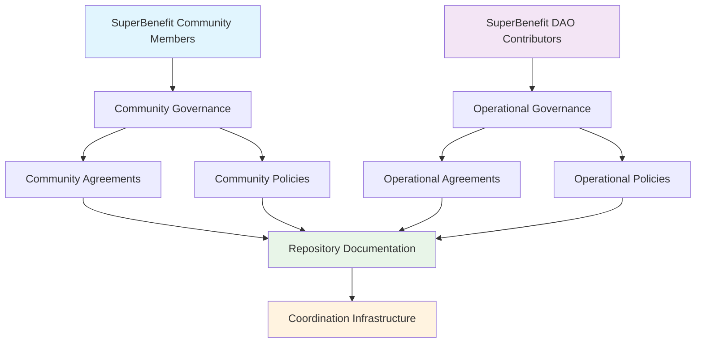
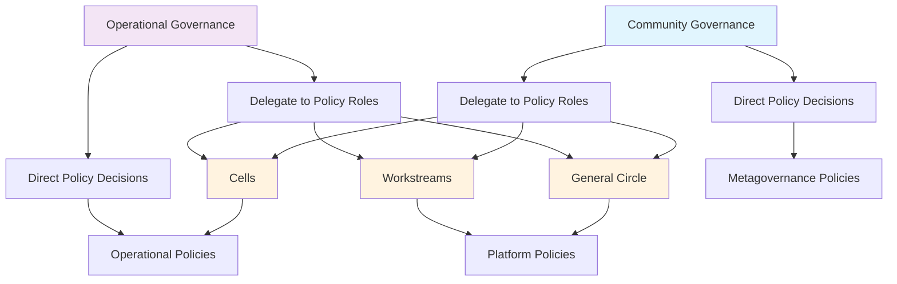
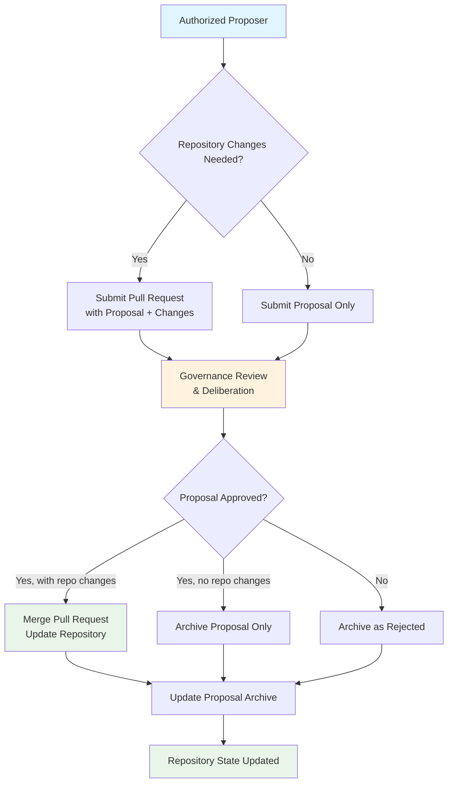
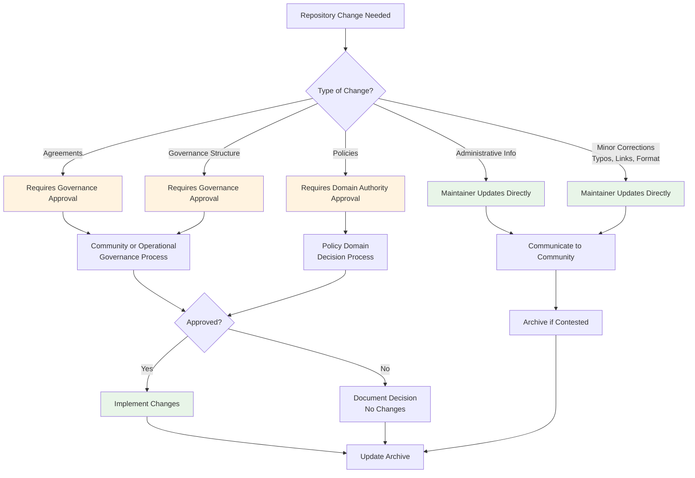

# SuperBenefit DAO Governance Repository Maintenance

This document establishes the framework for maintaining and evolving SuperBenefit DAO's governance repository. This repository serves as the canonical source of truth for our agreements, policies, and governance history, enabling transparent coordination across our purpose-aligned network of autonomous teams and diverse community participants.

## Purpose and Foundational Principles

SuperBenefit DAO's governance repository functions as coordination infrastructure that enables our community and organization to work together effectively while maintaining distinct identities, needs, and contributions. Rather than imposing uniform frameworks, this repository documents coordination mechanisms that enable different participants to contribute meaningfully while maintaining coherence around our shared mission.

The repository creates coordination infrastructure rather than rigid control mechanisms, establishing clear boundaries and interfaces that enable diverse participants to coordinate spontaneously around shared purpose. This approach recognizes that effective coordination within SuperBenefit often emerges organically when appropriate frameworks exist to support it.

The repository maintains dynamic alignment between documentation and actual coordination practices, ensuring our recorded governance accurately reflects how groups actually work together rather than aspirational frameworks. All changes to repository content must trace to legitimate governance decisions made through processes that provide appropriate opportunities for different participant types to engage meaningfully in decision-making.

## Repository Relationship to SuperBenefit's Governance System

The repository documents and implements coordination mechanisms developed through SuperBenefit's governance processes rather than creating governance unilaterally. This preserves legitimacy by ensuring documented frameworks reflect decisions made through inclusive processes that respected different participant perspectives and needs.

SuperBenefit operates through a membership structure recognizing two primary domains of participation, each with its own governance authority. Community governance includes all SuperBenefit community members and addresses matters affecting the broader ecosystem, cultural standards, and shared values. Operational governance includes SuperBenefit DAO contributors who take on formal roles and addresses resource allocation, project coordination, and organizational structure.

Each repository change must trace to legitimate authority gained through appropriate governance processes. When gaps emerge between documented coordination mechanisms and actual practices, resolution requires determining whether practices should align with existing frameworks or whether governance processes should develop updated approaches that better serve current participant configurations.

## Agreement Governance and Modification Processes

SuperBenefit's agreements establish foundational relationships that enable coordination across our diverse network. These agreements are governed by their respective membership classes, ensuring no single governance body can bind others to agreements they did not collectively approve.

Community agreements establishing cultural foundations and behavioral expectations for all SuperBenefit participants are governed through community governance processes. All community members have voice in shaping these agreements through established proposal and deliberation processes. Changes require formal proposals submitted to community governance, ensuring broad participation in modifications to our cultural foundations.

Operational agreements defining structures and processes within SuperBenefit DAO are governed through operational governance processes including SuperBenefit DAO contributors. These address decision-making frameworks, resource allocation systems, and coordination mechanisms enabling effective organizational function. Modifications must originate from formal proposals submitted through SuperBenefit DAO's governance processes.

Constitutional elements that explicitly affect relationships between membership classes or SuperBenefit's fundamental structure require broader governance processes including input from affected participant types. These elements will be documented in constitution.md rather than specific agreement directories, reflecting their foundational nature and broad applicability.

All agreement modifications follow established proposal processes within respective governance domains. Proposals must clearly identify changes being made, provide rationale for necessity, and demonstrate alignment with SuperBenefit's purpose and values. Agreement changes require repository implementation only after formal approval through appropriate governance processes.

## Policy Governance and Domain Authority

SuperBenefit's policies translate foundational agreements into practical coordination mechanisms across different activity domains. Policy governance follows the same membership-based authority structure as agreements, with additional delegation mechanisms enabling responsive policy development within established boundaries.

Community and operational governance bodies may make high-level policy decisions directly through proposal processes, establishing frameworks guiding coordination within respective domains. More commonly, these bodies delegate policy-making authority through agreements, creating specialized policy domains managed by specific roles, circles, or teams.

Policy domains operate with appropriate autonomy within boundaries established by their delegating governance body. These delegations respect SuperBenefit's subsidiarity principle by placing decision-making authority with those closest to the impact. Policy-making roles decide their own processes for managing policies within domains, provided these processes are published publicly and remain accessible to relevant stakeholders.

Policy changes can be implemented through decisions from delegated policy-making roles without requiring formal proposals to broader governance bodies, enabling responsive adaptation to changing circumstances. Cross-domain policy changes or modifications affecting fundamental governance structures require approval from governance bodies with authority over affected domains.

## Proposal Processes and Repository Integration

SuperBenefit's proposal system creates pathways for authorized participants to suggest changes through established governance processes. Any authorized proposer may submit proposals to governance spaces they can access, with authorization criteria published in relevant metagovernance policies.

Proposals requiring repository content changes are submitted as pull requests containing both the proposal document and specific changes that would be made to governance documentation if approved. This integration ensures governance decisions translate directly into documentation updates while maintaining clear connections between collective decisions and their implementation.

Not all proposals require repository modifications beyond archival documentation. Proposals regarding resource allocation, role selection, or other governance actions that don't change foundational agreements typically require only addition to the proposal archive. However, all proposal outcomes are documented in the archive, creating comprehensive historical records of SuperBenefit's governance evolution.

The proposal process follows established metagovernance policies unless specific policy domains have established alternative processes within their delegated authority. Default rules apply to all proposals unless explicitly overridden by domain-specific policies remaining within established authority boundaries.

## Repository Maintenance and Quality Assurance

Repository maintenance balances responsive updates with governance integrity through established protocols distinguishing between different content change types. Administrative updates such as contact information, project status, and organizational details may be made by repository maintainers without formal governance approval, provided changes are communicated to relevant governance spaces.

Changes to agreements, policies, and governance structures require formal approval through appropriate governance processes before implementation. Repository maintainers verify that implemented changes accurately reflect approved governance decisions, maintain internal documentation consistency, and preserve clear connections between collective decisions and their documentation.

Minor corrections including typographical errors, formatting improvements, and broken link repairs may be implemented without formal approval provided they do not alter content meaning. Such changes are communicated to relevant governance spaces and reviewed during regular governance activities to maintain transparency.

Quality assurance includes regular review of cross-references, terminology consistency, and navigation accessibility to ensure the repository serves diverse participants effectively. Repository maintainers collaborate with governance facilitators and community members to identify improvement areas and implement changes enhancing usability while maintaining governance integrity.

## Conflict Resolution and Appeals

Disputes regarding repository content, state management, or implementation of governance decisions are addressed through SuperBenefit's established dispute resolution mechanisms. These processes provide structured pathways for raising concerns and seeking resolution while maintaining governance legitimacy and community relationships.

When community members disagree about policy interpretation, documentation accuracy, or implementation approaches, they engage established processes rather than operating on conflicting assumptions that could undermine coordination. Dispute resolution emphasizes learning and relationship repair while addressing substantive governance effectiveness concerns.

Appeals regarding repository changes that allegedly misrepresent approved governance decisions utilize processes integrated with broader governance oversight mechanisms. These enable review and correction while maintaining accountability for repository stewardship that honors collective governance rather than individual preferences.

## Evolution and Continuous Improvement

This governance document itself evolves through SuperBenefit's established governance processes, ensuring repository maintenance remains subject to community authority rather than being modified through administrative convenience. When coordination frameworks require modification, they follow community processes welcoming participation from different participant types.

Regular evaluation of repository effectiveness considers whether current approaches adequately support governance transparency, enable responsive documentation updates, prevent inappropriate modifications, and serve diverse community needs. Feedback from repository users and governance participants informs ongoing improvements to both content and maintenance processes.

The repository succeeds when it enables effective coordination that enhances collective capacity across diverse participant types rather than requiring conformity to single coordination approaches. SuperBenefit's governance repository maintenance balances stability with adaptation, preserving institutional memory while remaining responsive to changing coordination needs and participant configurations.