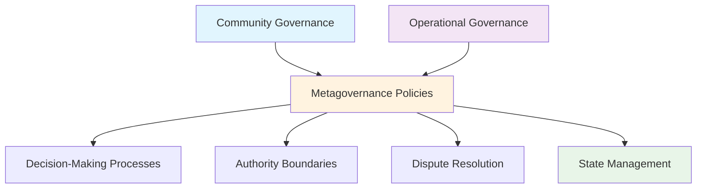
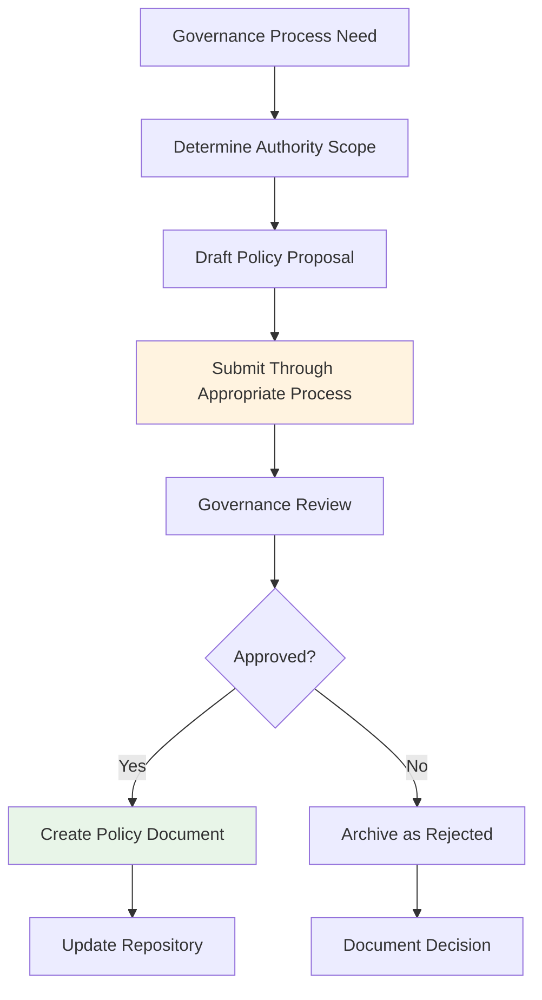
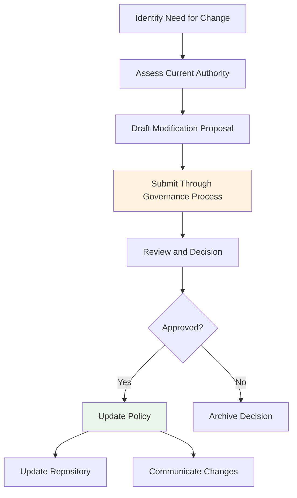

# Metagovernance Policies Directory

This directory contains policies governing SuperBenefit's decision-making processes, governance evolution, and dispute resolution mechanisms. For conceptual understanding of metagovernance's role, see [index.md](index.md). This readme provides technical guidance for creating and modifying metagovernance policies within SuperBenefit's governance framework.

## Understanding Metagovernance Authority

Metagovernance is governance about governance – systems that determine how other decisions are made. These policies have special significance because they establish the rules of the game for everything else. While operational policies focus on specific activities, metagovernance creates the context in which all governance happens.

Metagovernance policies establish the constitutional framework for all other governance activities within SuperBenefit. These policies determine how decisions are made, who has authority over what areas, and how conflicts are resolved.

SuperBenefit operates through dual governance domains as established in [GOVERNANCE.md](../../GOVERNANCE.md):

## Policy Authority Framework

Metagovernance policies can originate from different governance authorities depending on their scope:

### Universal Metagovernance
Policies affecting fundamental decision-making processes across both governance domains typically require coordinated input. The specific process for this coordination should be established through metagovernance policies themselves.

### Domain-Specific Metagovernance  
Each governance domain may establish metagovernance policies specific to their own decision-making processes within their authority boundaries.

## Creating Metagovernance Policies

Metagovernance policy creation follows the proposal process established in the core governance framework, with additional consideration for their constitutional significance.

### Policy Development Workflow

## Current Policy Areas

### State Management Subdirectory

The [state](state/) subdirectory contains policies governing repository maintenance and governance documentation, including:
- Repository update procedures 
- Proposal archival standards
- Documentation quality frameworks

### Future Metagovernance Areas

Additional metagovernance policies will address areas such as:
- Proposal processes and requirements
- Voting mechanisms and thresholds  
- Dispute resolution procedures
- Amendment processes for governance evolution

## Modifying Metagovernance Policies

Changes to metagovernance policies require careful consideration due to their impact on all other governance activities. The specific modification process depends on the policy's authority source and scope.

### General Modification Process

## Integration with Other Policy Domains

Metagovernance policies create the procedural foundation that enables other policy domains to function. They establish:
- How authority is delegated to specialized policy domains
- Universal proposal processes that all domains can use
- Conflict resolution mechanisms for inter-domain disputes
- Repository maintenance standards that preserve governance integrity

## Quality Considerations

Metagovernance policies require exceptional clarity since they affect all other governance activities:
- Use accessible language that serves all participants
- Provide clear procedures that can actually be implemented
- Build in learning mechanisms for governance improvement
- Ensure processes accommodate different participation styles

Effective metagovernance creates trusted processes that enable participants to focus on substantive governance rather than procedural questions.