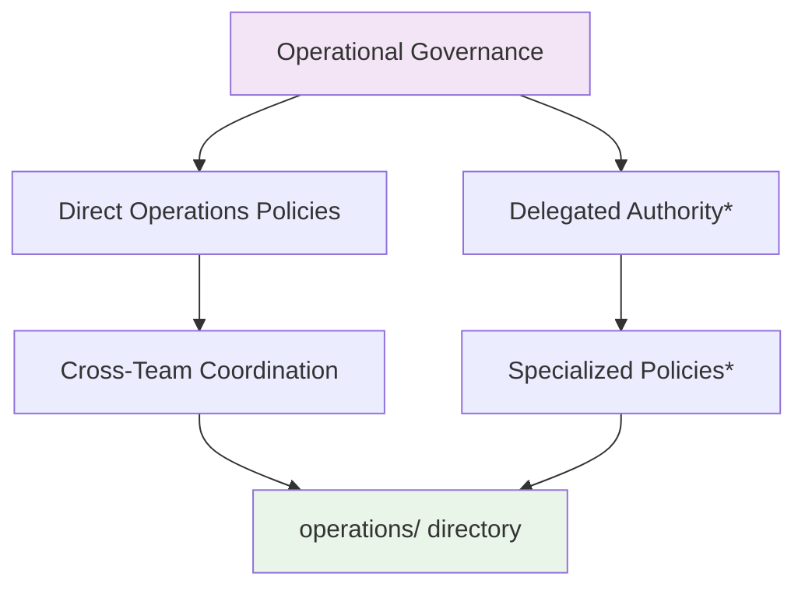
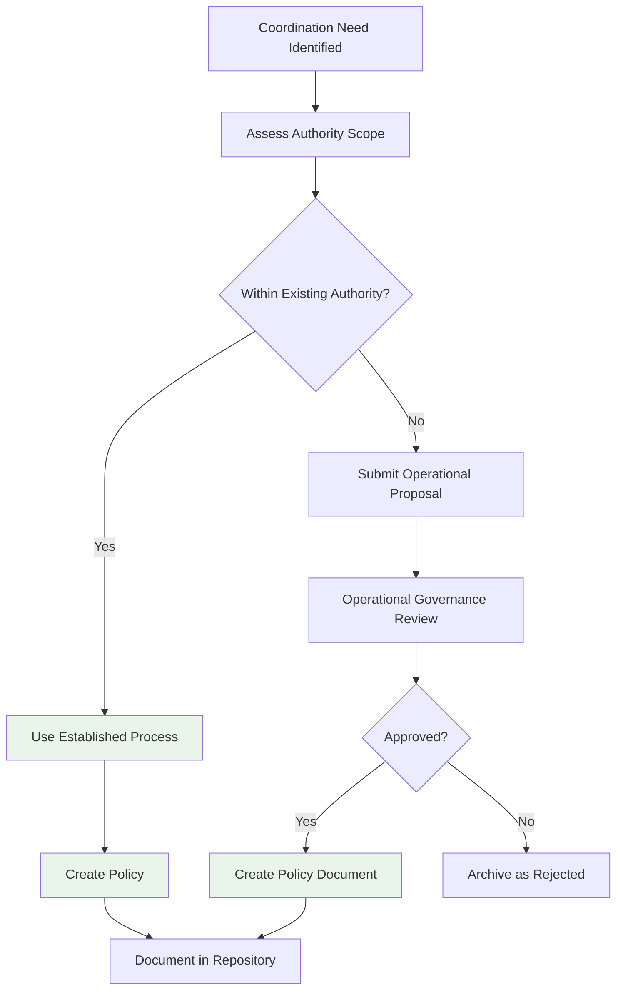

# Operational Policies Directory

This directory contains policies governing SuperBenefit DAO's operational coordination - how work gets organized, how resources are managed, and how contributors coordinate their activities. For conceptual understanding of operational governance, see [index.md](index.md). This readme provides technical guidance for creating and modifying operational policies within SuperBenefit's governance framework.

## Understanding Operational Policy Authority

Operational policies are governed through operational governance processes, which include SuperBenefit DAO contributors as defined in the [Operating Agreement](/agreements/dao/operating-agreement.md). This ensures operational coordination mechanisms reflect input from those actively engaged in organizational work.

The operations domain operates within authority delegated through operational agreements, enabling responsive policy development for coordination needs:

*Specific delegation mechanisms to be established through operational agreements

## Policy Authority Structure

Operations policies can be created through different pathways based on their scope and the authority structures established in operational agreements:

### Direct Operational Policies
Operational governance creates policies directly for matters requiring organizational-level coordination, such as:
- Cross-team coordination standards
- Resource allocation frameworks  
- Accountability mechanisms spanning different work areas

### Delegated Policy Authority
Operational governance may delegate policy-making authority to specific roles, teams, or structures as defined in operational agreements. The scope and boundaries of these delegations will be documented as they are established.

## Creating Operations Policies

Operations policy creation emphasizes practical effectiveness and responsiveness to coordination needs.

### Policy Development Workflow

### Policy Development Principles

Operations policies should embody SuperBenefit's approach to organizational coordination:
- **Subsidiarity**: Delegate authority to those closest to the work
- **Minimum Viable Coordination**: Create just enough structure to enable effective collaboration
- **Autonomous Teams**: Preserve flexibility for teams to adapt their approaches  
- **Evolutionary Design**: Enable policies to adapt based on practical experience

## Policy Domain Management

The operations domain manages policies through processes established in operational agreements and governance decisions. Specific governance processes will be documented as they are developed.

### Cross-Team Coordination

When operations policies affect multiple teams or organizational coordination, the authority and process for creating such policies depends on the structures established through operational governance.

## Modifying Operations Policies

Operations policy modifications follow processes that enable responsive adaptation while maintaining appropriate oversight:

### Authority-Based Modifications

Policies can be modified by the same authority that created them, following the processes established for that authority level:
- Policies created through delegated authority can be modified through the same delegation
- Policies created through operational governance require operational governance approval for changes

### Authority Boundary Changes

When proposed modifications would exceed existing authority boundaries, operational governance approval is required to either approve the specific change or expand the authority delegation.

## Integration with Community Foundation

Operations policies build upon the cultural foundation established by community agreements while creating coordination mechanisms that enable effective organizational function. This ensures organizational effectiveness serves community values rather than operating independently from them.

## Quality Considerations

Operations policies require attention to both practical effectiveness and organizational coherence:
- **Implementation Feasibility**: Ensure policies work given actual resource constraints and contributor capacity
- **Team Autonomy**: Preserve appropriate flexibility while maintaining necessary coordination
- **Value Alignment**: Regular assessment of how well coordination mechanisms serve SuperBenefit's mission
- **Learning Integration**: Build in mechanisms for adapting policies based on practical experience

Operations policies succeed when they enable effective coordination that enhances collective capacity while honoring the autonomy contributors need to do their best work.