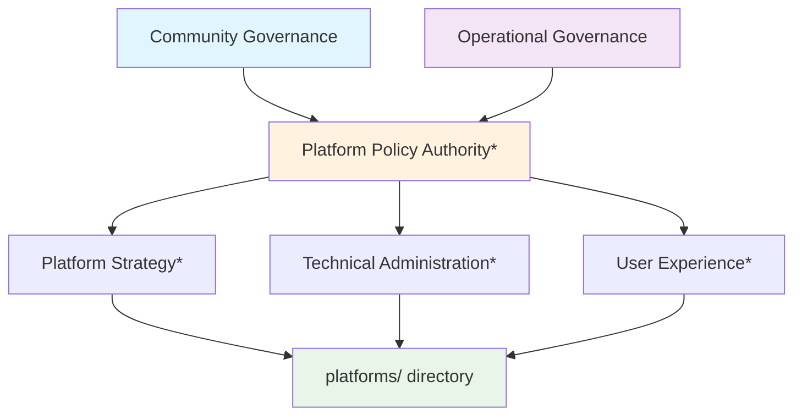
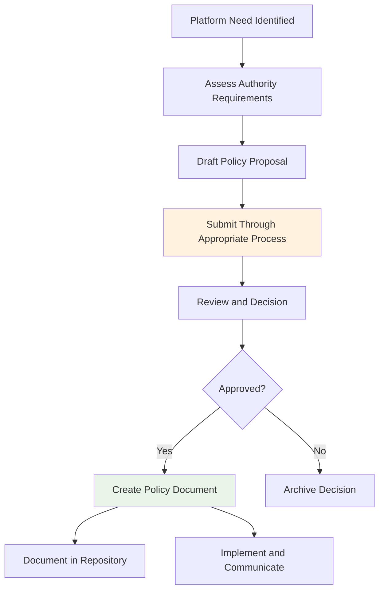
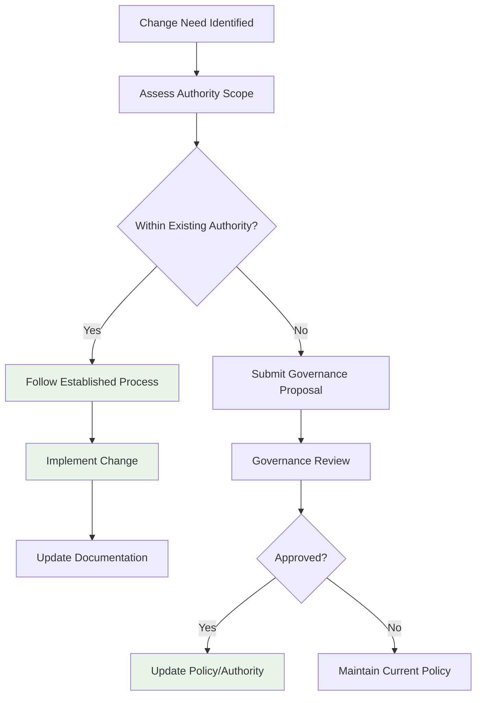

# Platform Policies Directory

This directory contains policies governing SuperBenefit's digital infrastructure - the tools, systems, and online spaces that enable collaboration across our community and organization. For conceptual understanding of platform governance, see [index.md](index.md). This readme provides technical guidance for creating and modifying platform policies within SuperBenefit's governance framework.

## Understanding Platform Policy Authority

Platform policies govern digital infrastructure that serves both SuperBenefit community members and SuperBenefit DAO contributors. This requires coordination between governance domains while maintaining responsiveness to technical and user needs.

Platform policy authority operates through mechanisms that will be established through governance agreements:

*Specific authority structures to be established through governance agreements

## Creating Platform Policies

Platform policy creation balances user needs with technical requirements while maintaining security and accessibility for all SuperBenefit participants.

### Policy Development Workflow

### Human-Centered Policy Development

Platform policies should prioritize user experience and accessibility:

- Gather input from diverse platform users about their needs and challenges
- Ensure policies create accessible digital environments  
- Test policy implementations with actual users when possible
- Build in mechanisms for collecting ongoing user feedback

## Policy Domain Management

Platform policy management operates through processes that maintain technical effectiveness while ensuring democratic accountability. Specific governance processes and authority delegations will be documented as they are established.

## Modifying Platform Policies

Platform policy modifications follow processes based on their authority source and impact on users:

### General Modification Process

### User-Impact Considerations

Changes affecting user experience should include:

- User feedback collection before implementation when feasible
- Clear communication about changes and their rationale
- Transition support for significant changes
- Monitoring and adjustment based on user experience

## Integration with Overall Governance

Platform policies create the digital foundation that enables all other governance activities while remaining subject to the same democratic principles that guide other policy domains.

### Supporting Governance Infrastructure

Platform policies ensure that governance documentation, communication tools, and decision-making platforms remain accessible to authorized participants while maintaining the integrity of collective decisions.

## Quality Considerations

Platform policies require attention to both technical effectiveness and user experience:

- **Technical Sustainability**: Ensure policies create manageable administration requirements
- **User Inclusivity**: Design policies that welcome participation from people with different technical comfort levels
- **Security Balance**: Implement appropriate security without creating unnecessary barriers
- **Adaptability**: Build in mechanisms for adapting to changing technological contexts and user needs

Platform policies succeed when they create digital environments that feel natural and supportive rather than constraining, enabling effective collaboration across SuperBenefit's diverse participants.
