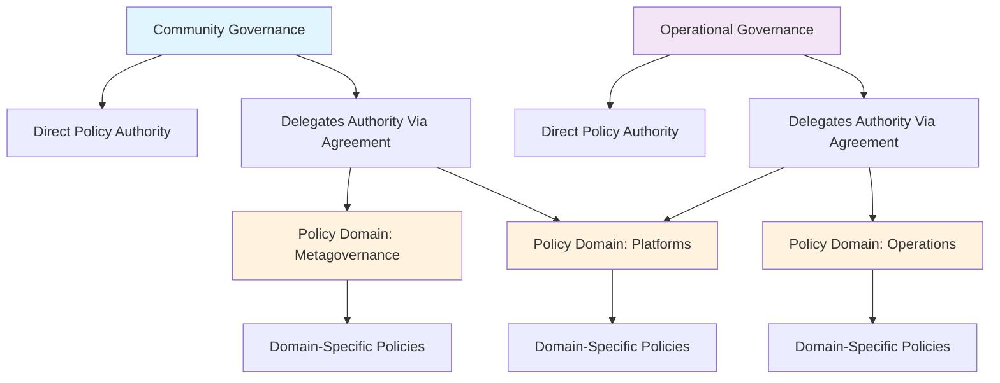
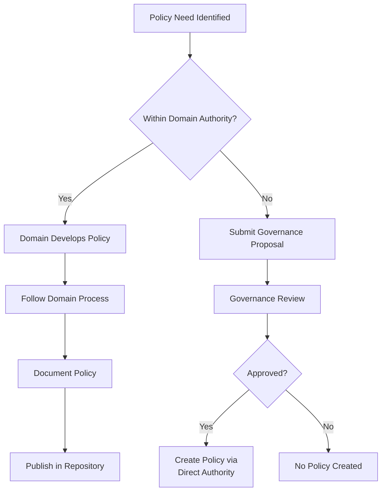

# Policies Directory

This directory contains SuperBenefit's operational policies that translate foundational agreements into practical coordination mechanisms. For understanding our policy philosophy and structure, see [index.md](index.md). This readme provides technical guidance for creating and modifying policies within SuperBenefit's governance framework.

## Understanding Policy Domains

We've designed this governance system around a foundational principle of subsidiarity - the idea that decisions should be made at the most local level possible by those who will be most affected. This is reflected in how policies are organized into separate domains, each with its own delegated authority.

The folder structure you see here isn't just organizational - it represents actual governance boundaries. Each subfolder represents a distinct policy domain with its own decision-making authority as defined in your organization's agreements. This approach balances autonomy with coordination, allowing specialized teams to govern their areas effectively while maintaining transparency across the organization.

For example, while the Metagovernance domain might establish how proposals are processed within the community governance system, the Operations domain has its own authority to determine how work is coordinated among contributors. These domains don't form a hierarchy - they represent different spheres of authority that work in parallel.

## Policy Authority Framework

SuperBenefit's policy governance follows the same membership-based authority as agreements, with additional delegation mechanisms that enable responsive policy development within established boundaries.



### Direct Policy Authority

Governance bodies can make policy decisions directly through proposal processes. This typically occurs for:
- High-level policy frameworks that don't fit existing domains
- Initial policy structures before delegation
- Cross-cutting policies affecting multiple domains

### Delegated Policy Authority

More commonly, governance bodies delegate policy-making authority to specific roles, circles, or teams through agreements. This delegation:
- Establishes the domain's scope and boundaries
- Identifies who holds policy-making authority
- Defines any constraints or reporting requirements
- Remains revocable through the delegating agreement

## Creating New Policies

Policies can be created through two pathways depending on their authority source.

### Direct Policy Creation (via Governance Proposal)

When a governance proposal directly establishes a policy:

1. **Extract policy content** from the approved proposal
2. **Determine appropriate domain** based on policy scope
3. **Create policy document** with clear structure:
   ```markdown
   ---
   description: What this policy governs
   ---
   
   # Policy Title
   
   Purpose statement and relationship to authorizing governance decision.
   
   ## Scope
   
   What activities/decisions this policy covers.
   
   ## Policy Framework
   
   The actual policy content, organized logically.
   
   ## Implementation
   
   How this policy is applied in practice.
   
   ## Modification Authority
   
   Who can change this policy and how.
   ```
4. **Place in correct domain** subdirectory
5. **Update domain index** to reference the new policy
6. **Archive proposal** per [proposals/readme.md](../proposals/readme.md)

### Delegated Policy Creation (via Domain Authority)

When creating policies within delegated authority:



Key considerations for delegated policy creation:
- **Verify authority**: Ensure the policy falls within delegated boundaries
- **Document process**: Each domain should publish its policy-making process
- **Maintain traceability**: Link to authorizing agreement
- **Communicate changes**: Notify affected stakeholders

## Policy Domain Management

Each policy domain operates semi-autonomously within its delegated boundaries. Domain management includes:

### Domain Structure

Each domain should maintain:
- `index.md` - User-facing overview of domain policies
- `readme.md` - Technical documentation for domain management
- Individual policy files organized by topic
- Clear subdirectory structure if needed

### Domain Governance Process

Domains must publish their internal governance processes, including:
- Who holds policy-making authority (roles/circles/teams)
- How policy decisions are made within the domain
- Review and modification procedures
- Stakeholder engagement methods

This information typically lives in the domain's readme file or a dedicated governance document.

### Cross-Domain Coordination

When policies affect multiple domains:
1. **Identify all affected domains** during policy development
2. **Coordinate with domain authorities** before finalizing
3. **Document interdependencies** clearly
4. **Establish modification protocols** that respect all domains

## Modifying Existing Policies

Policy modifications follow different processes based on the policy's authority source.

### Modifying Directly-Authorized Policies

Policies created through governance proposals require governance approval to modify:
1. Submit proposal to appropriate governance body
2. Follow standard proposal process with pull request
3. Update policy upon approval
4. Archive modification proposal

### Modifying Domain-Managed Policies

Policies within delegated domains can be modified by domain authorities:
1. Follow the domain's published modification process
2. Ensure changes remain within delegated boundaries
3. Update policy document with clear version history
4. Communicate changes to affected parties

### Boundary Changes

If a modification would exceed domain authority:
- The domain cannot make the change directly
- A governance proposal is required to either:
  - Approve the specific change
  - Expand the domain's delegated authority

## Policy Lifecycle Management

Unlike agreements which tend to be stable, policies require more active management to remain relevant and effective.

### Policy Reviews

Each domain should establish review cycles for its policies:
- Regular reviews (annually, quarterly, etc.)
- Trigger-based reviews (after specific events)
- Stakeholder feedback integration
- Effectiveness assessment

### Policy Retirement

When policies become obsolete:
1. **Document the retirement decision** through appropriate process
2. **Archive the policy** with clear end date
3. **Update references** in other documents
4. **Communicate sunset** to affected parties

### Policy Evolution

Policies should evolve based on:
- Practical experience with implementation
- Changing organizational needs
- Stakeholder feedback
- Lessons learned from other domains

## Implementation Guidance

Effective policies bridge between governance decisions and practical action. Consider:

### Clarity and Specificity

- Define terms clearly
- Provide concrete examples
- Specify decision criteria
- Include exception handling

### Operational Integration

- Align with existing workflows
- Identify implementation responsibilities
- Create feedback mechanisms
- Establish success metrics

### Documentation Standards

- Use consistent formatting across domains
- Maintain clear version history
- Include implementation date
- Reference authorizing decisions

## Common Policy Patterns

Experience has revealed effective patterns for different policy types:

**Process Policies**: Step-by-step procedures with decision points
**Framework Policies**: Principles and boundaries for autonomous decisions  
**Standards Policies**: Specific requirements and compliance criteria
**Coordination Policies**: Interfaces between different organizational units

Select patterns that match your policy's purpose while maintaining flexibility for evolution.

## Quality Assurance

While [state management](metagovernance/state/readme.md) provides overall quality frameworks, policy-specific considerations include:

- **Practicality**: Can this actually be implemented?
- **Measurability**: Can we assess effectiveness?
- **Maintainability**: Will this remain manageable as we scale?
- **Alignment**: Does this support our agreements and values?

Regular quality reviews help identify policies needing refinement or retirement.