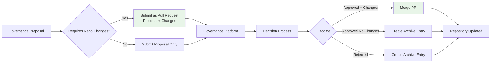
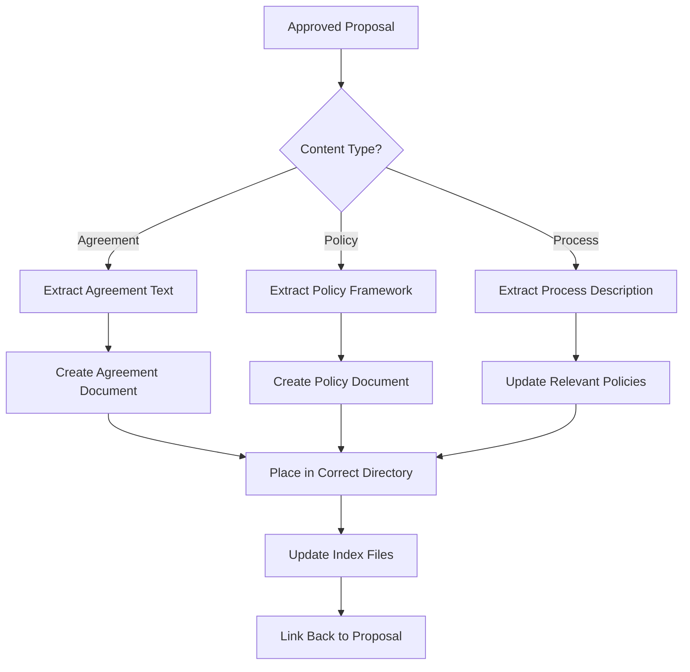

# Proposals Directory

This directory maintains SuperBenefit's historical record of governance proposals and their outcomes. For understanding the role of proposals in our governance, see [index.md](index.md). This readme provides technical workflows for archiving proposals and implementing their outcomes in the repository.

## Proposal Integration with Repository

SuperBenefit's governance system tightly integrates proposals with repository maintenance. This integration ensures that collective decisions translate directly into documented governance changes while maintaining clear accountability trails.



### Pull Request Workflow

When proposals require repository changes (new agreements, policy modifications, etc.), they should be submitted as pull requests containing:

1. **Proposal document** in `/proposals` directory following archive template
2. **Specific changes** to agreements, policies, or other governance documents
3. **Cross-reference updates** ensuring consistency
4. **Clear commit message** linking to governance platform

This approach creates immediate visibility of proposed changes and enables direct implementation upon approval.

## Archiving Proposals

All proposals that reach formal decision stage must be archived, regardless of outcome. This comprehensive record enables institutional learning and accountability.

### Archive Structure

Each proposal archive entry follows the template in [/policies/metagovernance/state/proposal-archive-template.md](../policies/metagovernance/state/proposal-archive-template.md):

```markdown
---
description: [Brief proposal summary]
---

# [Proposal Number] - [Proposal Title]

[One-sentence description]

**Proposed by**: [Author(s)]  
**Submitted**: [Date]  
**Status**: [Approved/Rejected/Withdrawn] ✅/❌/⚠️

[🗣️ Discussion](link-to-forum)  
[📊 Voting](link-to-snapshot)

## Proposal Text

[Complete original proposal content]

## Voting Results

**Outcome**: [Decision]  
**Vote Breakdown**: [Detailed statistics]  
**Participation**: [Metrics]

## Implementation

**Changes Made**: [What was implemented]  
**Timeline**: [Implementation schedule]  
**Current Status**: [Progress update]
```

### Creating Archive Entries

When archiving proposals:

1. **Create new file** in `/proposals` directory
   - Use format: `YYYY-MM-DD-short-title.md`
   - Example: `2024-03-15-general-circle-formation.md`

2. **Populate from template** including all required fields

3. **Preserve original content** - Include complete proposal text as submitted

4. **Document outcomes** accurately with voting data

5. **Track implementation** status for approved proposals

### Organizing the Archive

As the archive grows, implement organizational structures:

```
proposals/
├── index.md          # Overview and navigation
├── readme.md         # This file
├── 2024/            # Year-based organization
│   ├── Q1/          # Optional quarterly subdivision
│   ├── Q2/
│   └── ...
└── active/          # Currently implementing proposals
```

## Deriving Repository Content from Proposals

Approved proposals often establish new agreements or policies that must be extracted and properly documented in the repository.

### Content Extraction Workflow



### Implementation Steps

1. **Identify governance content** within the proposal:
   - Look for "RESOLVED" or "AGREED" sections
   - Find establishment of ongoing commitments
   - Locate delegation of authorities

2. **Extract and structure** the content:
   - Separate one-time decisions from ongoing governance
   - Organize into appropriate document sections
   - Maintain fidelity to approved language

3. **Create appropriate documents**:
   - Agreements → `/agreements/[domain]/`
   - Policies → `/policies/[domain]/`
   - Constitutional elements → `/constitution.md`

4. **Establish traceability**:
   - Link new documents to source proposal
   - Reference proposal number in document
   - Update proposal archive with implementation status

### Handling Complex Proposals

Some proposals establish multiple governance elements:

- **Multi-part agreements**: Create separate documents for distinct agreements
- **Agreement + policies**: Create agreement first, then derived policies
- **Phased implementation**: Document timeline in proposal archive

## Proposal Categories and Workflows

Different proposal types require different handling:

### Governance Structure Proposals

These establish or modify fundamental organizational structures:
- Often create new agreements
- May delegate policy authorities
- Require careful extraction of multiple elements
- Example: Creating the General Circle structure

### Resource Allocation Proposals

These make specific decisions about resource deployment:
- Usually don't create new governance documents
- Archive records the decision and rationale
- May reference existing policies
- Example: Approving annual budget

### Policy Modification Proposals

These change existing operational frameworks:
- Require updates to specific policy documents
- May affect multiple related policies
- Need careful cross-reference management
- Example: Updating voting thresholds

### Administrative Proposals

These handle organizational housekeeping:
- May not require any document changes
- Archive provides historical record
- Often reference existing authorities
- Example: Appointing new signers

## Status Tracking

Maintain clear status indicators for proposal implementation:

**✅ Implemented**: All required changes completed
**🔄 In Progress**: Implementation ongoing per timeline
**⏸️ Paused**: Implementation delayed (with reason)
**❌ Not Implemented**: Approved but not executed (with explanation)
**🚫 Rejected**: Proposal not approved
**⚠️ Withdrawn**: Proposal removed from consideration

Regular reviews of "In Progress" proposals ensure accountability for implementing collective decisions.

## Cross-Referencing

Effective cross-referencing creates navigable connections between proposals and their outcomes:

### In Proposal Archives

- Link to resulting agreements/policies
- Reference related proposals
- Connect to implementation documentation

### In Governance Documents

- Citation format: `per Proposal 2024-03-15`
- Link back to source proposal
- Note modification history

### In Index Files

- Highlight significant proposals
- Group related proposals
- Provide finding aids

## Quality Considerations

Proposal archives require particular attention to:

- **Completeness**: Include all relevant context
- **Accuracy**: Preserve exact voting outcomes
- **Timeliness**: Archive promptly after decisions
- **Accessibility**: Organize for easy discovery

The [state management policies](../policies/metagovernance/state/readme.md) provide additional quality frameworks applicable to proposal archiving.

## Integration with External Platforms

SuperBenefit uses various platforms for governance deliberation. Maintain consistent practices when archiving from:

- **Snapshot**: Export voting data and participation metrics
- **Forum**: Link to discussion threads (consider archiving key points)
- **Discord**: Reference significant discussions without reproducing
- **GitHub**: Connect pull requests to governance decisions

Always preserve links to original platforms while ensuring the archive contains sufficient information to understand decisions independently.

## Common Patterns and Best Practices

Through experience, these patterns support effective proposal management:

1. **Archive immediately** after decision to preserve context
2. **Use consistent naming** for easy chronological sorting
3. **Preserve original intent** even if implementation differs
4. **Document lessons learned** from complex implementations
5. **Regular implementation reviews** to ensure accountability

The proposal archive serves as SuperBenefit's institutional memory, enabling us to build on past decisions rather than repeatedly addressing similar challenges.